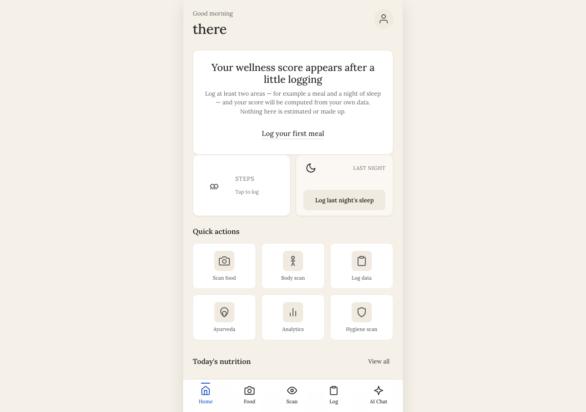
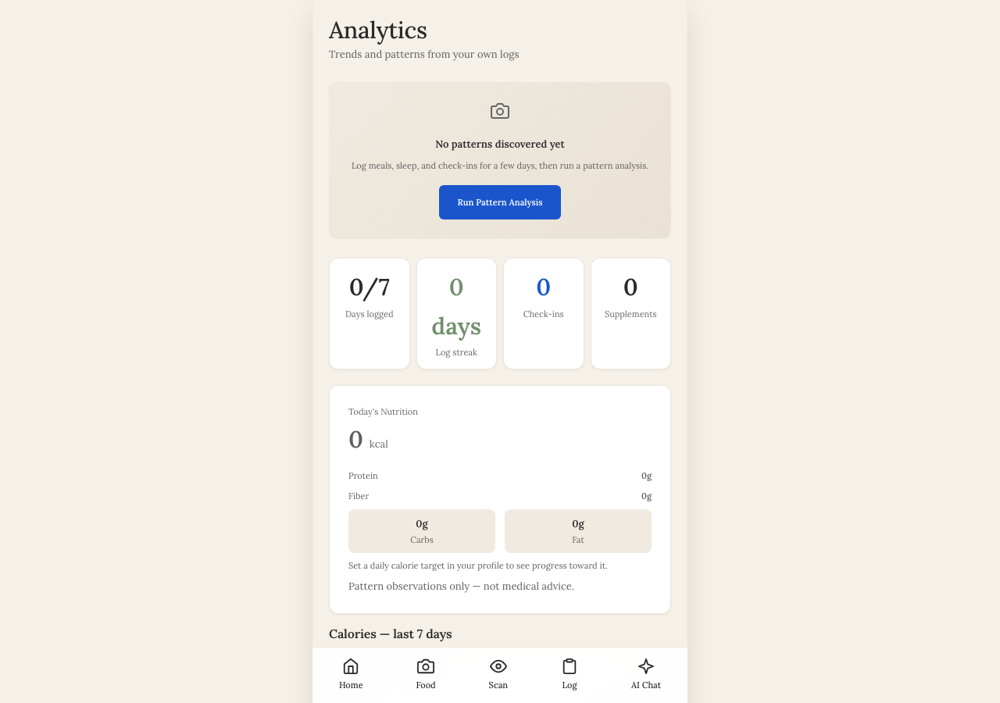
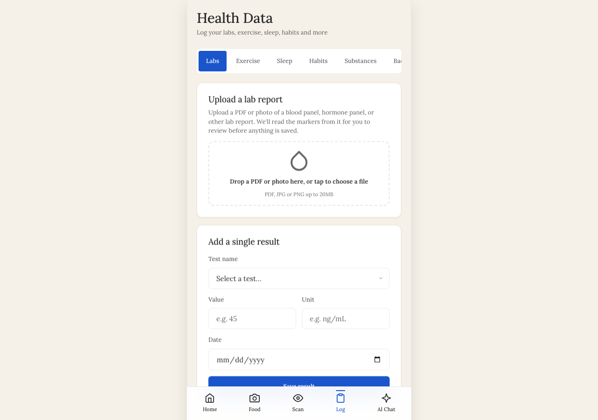
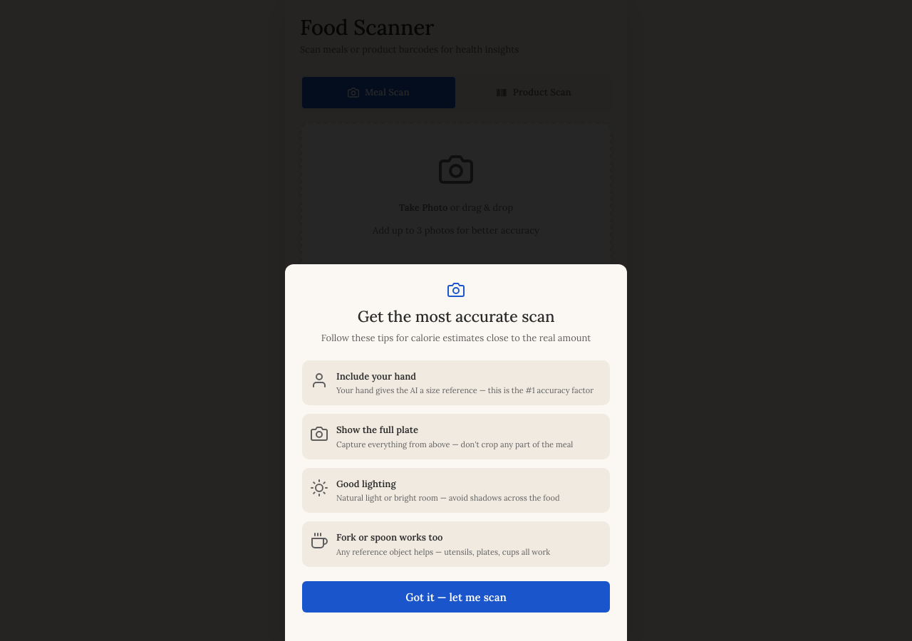
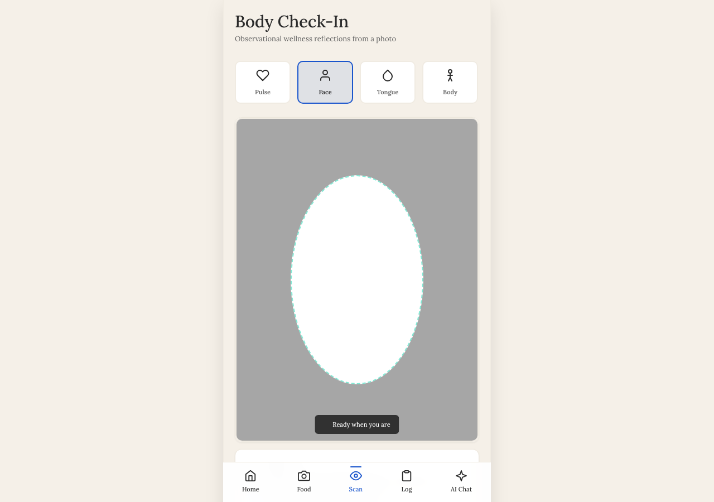
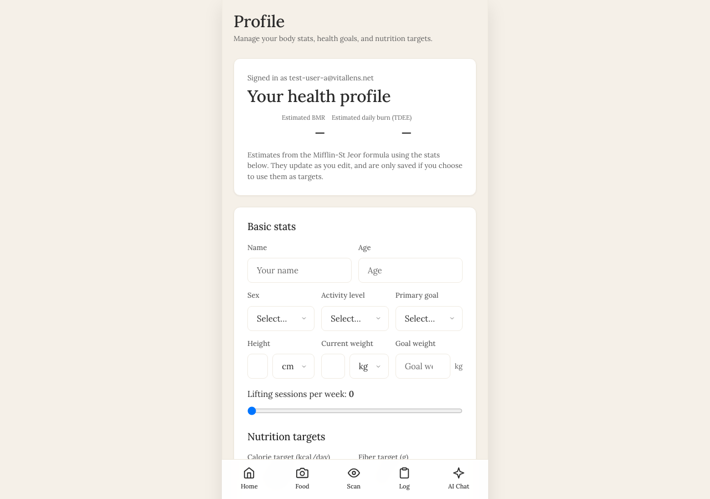

# VitalLens

A personal wellness journal that turns everyday logging — meals, sleep, habits, check-ins — into patterns you can actually see. Photograph a meal and get calories from real nutrition databases; ask a copilot that answers only from *your* data; watch a wellness score that is computed from what you logged and never estimated.

Built as a full-stack portfolio project: a vanilla-JS PWA on a hardened Express API over Supabase, with AI (GPT-4o vision, Claude, pgvector RAG) wrapped in cost controls and a strict wellness-only framing.

> **Not a medical device.** VitalLens does not diagnose, screen, or treat. Every AI output is an observation about the user's own logs, and every number on screen comes from data the user entered.

---

## Screenshots

Captured from the running app as a fresh test user (nothing logged yet), so every
"insufficient data" state is the real one.

| Dashboard | Analytics | Health data |
|---|---|---|
|  |  |  |

| Food scanner | Body check-in | Profile |
|---|---|---|
|  |  |  |

Phone layout (390 px): [dashboard](docs/screenshots/mobile-dashboard.png) ·
[analytics](docs/screenshots/mobile-analytics.png) ·
[health data](docs/screenshots/mobile-health-input.png).

## What it does

| Area | Feature |
|---|---|
| **Food** | Photo scan → barcode-first lookup (Open Food Facts) → GPT-4o identifies foods + gram estimates → calories from USDA / Open Food Facts, never from the model. Correction loop and "meal memory" for repeat meals. |
| **Logging** | Meals, sleep, exercise, habits (water, stress, mood, steps), supplements, medications (log only), cycle, labs (PDF parsed by GPT-4o), environment. |
| **Insight** | Wellness score across logged domains; correlation engine (Claude) with a second-pass language-safety review; trend patterns; weekly summary; an AI copilot with retrieval over the user's own `health_events` (pgvector). |
| **Account** | Email + password with optional TOTP two-factor; versioned consent gate; full JSON export; one-click account deletion (cascades through every table); Stripe subscription with usage-gated free tier. |
| **PWA** | Installable, offline shell, queued writes that sync when back online — and *never* report a failed write as saved. |

## Architecture

```mermaid
flowchart LR
  subgraph Browser["PWA (Vite, vanilla JS + React islands)"]
    UI[Hash router + pages]
    DB1[Supabase JS · RLS-scoped reads/writes]
    API1[apiFetch · Bearer JWT]
  end
  subgraph Server["Express API (single process)"]
    MW[JWT verify (local JWKS) → ownership guard → rate limits]
    Gates[usage gates + hard spend guard]
    Routes[35 routers]
    Engines[vision · copilot · correlation · prediction · weekly]
  end
  subgraph Supabase
    PG[(Postgres · RLS on every table · pgvector)]
    Auth[Supabase Auth]
  end
  UI --> DB1 --> PG
  UI --> API1 --> MW --> Gates --> Routes --> Engines
  Routes -->|service role| PG
  Auth -->|JWT| API1
  Engines --> OpenAI & Anthropic
  Routes --> Ext[USDA · Open Food Facts · Open Beauty Facts · Google Vision]
  Engines --> Redis[(Upstash · context cache)]
  Routes --> Stripe
```

Two data paths, two independent safety layers: direct Supabase access from the browser is bounded by **row-level security on every table**; API access is bounded by **local JWT verification plus a global ownership guard** that rejects any request naming another user.

## Security & correctness — what's actually enforced

- **Auth**: Supabase JWTs verified locally against the project JWKS (`jose`) — no network call per request. Multipart routes derive the user from the token, never from the form body.
- **Data isolation**: RLS owner policies on 39 tables (`(select auth.uid()) = user_id`, evaluated once per query); `user_id` is `uuid` everywhere with `ON DELETE CASCADE` to `auth.users`, so account deletion is complete.
- **Cost control**: a Postgres-aggregated **spend guard** ($5 / $50 / $250 monthly caps) runs before every model call and fails *closed* on the global cap; free-tier counters use an **atomic `increment_usage` RPC** (no read-modify-write race). Every AI call — including embeddings — is priced and logged. A cap set to `0` is honoured as a kill switch, and request validation runs *before* the daily gate so a 400 never burns quota.
- **Web**: strict CSP (`script-src 'self'`), HSTS, `frame-ancestors 'none'`; the auth library is bundled, not loaded from a CDN; every user- and AI-controlled string is HTML-escaped at the sink. Product analytics (PostHog) is bundled and dynamically imported only when `VITE_POSTHOG_KEY` is set — no third-party scripts, no session recording.
- **Honesty**: the wellness score returns `insufficient_data` until two domains are logged; no placeholder targets (nutrition is scored only against the profile's own calorie target — no 2,000 kcal or 10,000-step defaults), no synthetic step counts, no fabricated trend lines ("No trend yet" until two weekly scores exist); values a source didn't supply stay `null` ("Rating unavailable", "Score unavailable", "No entry"). A CI lint fails the build if diagnostic or disease language appears in user-facing copy or prompts.
- **Observability & resilience**: Sentry is preloaded (`node --import ./instrument.js server.js`) so Express itself is instrumented; every route error is captured with request bodies, query strings, cookies, and auth headers stripped before send; an `unhandledRejection` is reported without taking the process down, an `uncaughtException` is reported, flushed, then exits. Timeouts everywhere: a fresh per-attempt AI timeout inside a 45 s retry budget, 15 s on every database request, 10 s on Oura. `/api/ready` is a one-row database probe, `/api/health` is liveness only; graceful `SIGTERM` drain with a 60 s grace.
- **Accessibility**: real `<button>`s everywhere, associated labels, visible focus rings, ≥4.5:1 text contrast, 44px touch targets, `aria-live` scoped to status regions, WAI-ARIA tablists with arrow-key navigation, nothing rendered below 11 px, pinch-zoom enabled, reduced-motion respected.

## Running locally

Two processes. Copy `.env.example` → `.env` (frontend) and `server/.env.example` → `server/.env`, fill in Supabase, OpenAI, and Anthropic keys, then:

```bash
# API  → http://localhost:3001
cd server && npm install && npm start

# App  → http://localhost:3000
npm install && npm run dev
```

### Environment

| Where | Variable | Notes |
|---|---|---|
| frontend | `VITE_SUPABASE_URL`, `VITE_SUPABASE_ANON_KEY` | Public anon key; RLS protects the data |
| frontend | `VITE_API_BASE` | API origin. Unset in a production build → falls back to `https://api.vitallens.app` (Vite prints a warning at build time) |
| frontend | `VITE_POSTHOG_KEY` (+ `VITE_POSTHOG_HOST`) | Optional. PostHog is bundled and only initialised when set |
| frontend | `VITE_VAPID_PUBLIC_KEY` | Optional. Lets the Notifications toggle subscribe to web push |
| server | `SUPABASE_URL`, `SUPABASE_ANON_KEY`, `SUPABASE_SERVICE_ROLE_KEY` | The service-role key never leaves the server |
| server | `OPENAI_API_KEY`, `ANTHROPIC_API_KEY`, `GOOGLE_CLOUD_API_KEY`, `USDA_API_KEY` | AI + nutrition/OCR lookups |
| server | `FRONTEND_URL`, `API_PUBLIC_URL`, `OAUTH_STATE_SECRET` | CORS allow-list; public API origin for OAuth redirects; HMAC secret for OAuth `state` (falls back to a hash of the service-role key) |
| server | `MAX_USER_MONTHLY_USD`, `MAX_USER_MONTHLY_USD_PREMIUM`, `MAX_GLOBAL_MONTHLY_USD` | Spend caps (5 / 50 / 250); `0` is a kill switch |
| server | `VAPID_PUBLIC_KEY`, `VAPID_PRIVATE_KEY`, `VAPID_EMAIL` | Optional. Web push |
| server | `STRIPE_*`, `UPSTASH_REDIS_REST_*`, `SENTRY_DSN`, `OURA_CLIENT_*` | Billing, context cache, monitoring, wearables |
| server | `ENABLE_EXPERIMENTAL_ROUTES` | `true` mounts practitioner sharing + genomics (default off) |

Database: apply `server/supabase/schema-baseline.sql` to an empty Supabase project (extensions, tables, RLS, policies, functions), then the reference seed `server/supabase/seed/additive_classifications.sql` (28 rows; without it every additive scores `unknown`). Incremental history lives in `server/supabase/migrations/`.

## Quality gates

```bash
npm run lint && npm test && npm run build          # frontend: ESLint, 60 Vitest (jsdom) unit tests, Vite
cd server && npm run lint && npm test              # server: ESLint, 74 unit tests (no network)
cd server && npm run test:integration              # 20 auth/ownership/consent tests against a real Supabase project
node scripts/check-regulatory-language.mjs        # wellness-only copy lint
```

CI runs all of the above on every push to both repositories.

## Project layout

```
src/                 PWA — pages/, components/ (React islands), utils/, lib/db.js, router.js, sw.js
server/              Express API — routes/, services/, middleware/, db/, supabase/ (schema + seed + migrations), tests/
docs/                Obsidian vault: architecture, data model, decision log, features, gotchas, glossary, roadmap
VitalLensMem/        Deep-dives: algorithms with exact formulas, route/service inventories, ops runbook
legal/               Terms of Service and Privacy Policy (drafts; rendered in-app)
AUDIT-2026-09.md     Full technical / product / legal audit and its remediation
```

## Stack

Vite 8 · vanilla JS + React 19 islands · Supabase (Postgres, Auth, RLS, pgvector) · Express 4 · `jose` · Zod · Stripe · Upstash Redis · OpenAI GPT-4o + `text-embedding-3-small` · Anthropic Claude Haiku 4.5 · Sentry · Vitest · ESLint · GitHub Actions

## Status

Feature-complete for a personal wellness journal and hardened against the findings of a full audit (see `AUDIT-2026-09.md`). Practitioner sharing and genomics parsing are implemented but ship **off** behind `ENABLE_EXPERIMENTAL_ROUTES` pending a compliance review. Wearable sync (Oura) is wired end-to-end and activates when developer credentials are configured.
