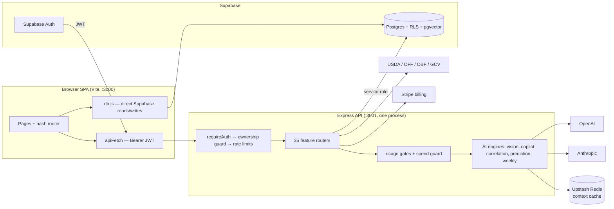

# Architecture

## Stack (from the actual package files)

- **Frontend**: vanilla-JS hash-router SPA served by Vite 8; `@supabase/supabase-js` for auth + RLS-scoped reads. React 19 "islands" (`src/components/*.jsx`, mounted with `mountReact`) power the wellness score card, pattern discovery hero, nutrition tracker, and hygiene result. PWA service worker (`sw.js`) registers in prod builds only. `posthog-js` is bundled and dynamically imported only when `VITE_POSTHOG_KEY` is set (CSP `script-src` stays `'self'`).
- **Backend**: single Express process (`server/server.js`) — express, helmet, cors, morgan, express-rate-limit, multer (uploads), zod (AI response validation), stripe, web-push, `@sentry/node`, `@upstash/redis` (context cache), dotenv. Started as `node --import ./instrument.js server.js` (`npm start`, `Procfile`, `railway.json`) so Sentry hooks Express before it loads; multer is 2.x.
- **Database**: Supabase Postgres (project `nlxptctihrotizvaywdo`) with RLS everywhere + pgvector for RAG. See [[data-model]].
- **AI**: OpenAI GPT-4o (vision meal scan, strict json_schema), `text-embedding-3-small` (1536-dim embeddings), Anthropic Claude Sonnet/Haiku (analysis engines + language-safety check).
- **External data**: USDA FoodData Central, Open Food Facts, Open Beauty Facts, Google Cloud Vision (OCR).

## Diagram

## The two data paths

1. **Direct Supabase from the SPA** (`src/lib/db.js`): the user's own CRUD
   (meals, habits, sleep, water…), protected by RLS owner policies.
2. **API routes**: anything with AI, secrets, aggregation, or third-party
   calls, protected by **local JWT verification** (jose + JWKS) and a global
   ownership guard (any `userId`/`user_id` must match the token; multipart
   routes take the user from the token) — see [[decision-log]].

## Boot & guards (frontend)

session? → `#/auth` · consents current? → consent gate · onboarded? →
`#/onboarding` · else page. Consent versions bump ⇒ automatic re-prompt.
After boot, `main.js` writes `profiles.timezone` (the API's "today" for that
user) and, with `VITE_VAPID_PUBLIC_KEY` set, keeps the web-push subscription
in step with the Notifications toggle.

## Reliability (server)

Fresh per-attempt timeout on every AI call inside a 45 s retry budget; 15 s on
every Supabase request; 10 s on Oura. `unhandledRejection` is reported to
Sentry and the process keeps serving; `uncaughtException` is reported,
flushed, then exits so the platform restarts it. `SIGTERM` drains with a 60 s
grace. `/api/ready` is a one-row `select`. The Stripe webhook is exempt from
the per-IP limiter. See [[decision-log]].

## Related

[[data-model]] · [[features]] · [[decision-log]] · [[gotchas]]
