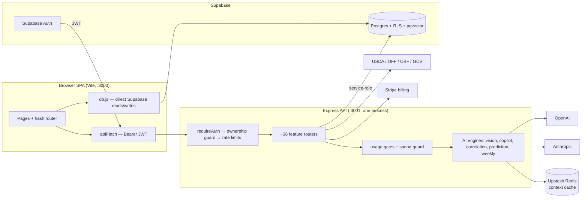

# Architecture

## Stack (from the actual package files)

- **Frontend**: vanilla-JS hash-router SPA served by Vite 8; `@supabase/supabase-js` for auth + RLS-scoped reads. React 19 + `@vitejs/plugin-react` are present in `package.json` **[INFERRED: for "React islands" / future use — no page currently mounts React; verify before removing]**. PWA service worker (`sw.js`) registers in prod builds only.
- **Backend**: single Express process (`server/server.js`) — express, helmet, cors, morgan, express-rate-limit, multer (uploads), zod (AI response validation), stripe, web-push, `@sentry/node`, `@upstash/redis` (context cache), pg, dotenv.
- **Database**: Supabase Postgres (project `nlxptctihrotizvaywdo`) with RLS everywhere + pgvector for RAG. See [[data-model]].
- **AI**: OpenAI GPT-4o (vision meal scan, strict json_schema), `text-embedding-3-small` (1536-dim embeddings), Anthropic Claude Sonnet/Haiku (analysis engines + language-safety check).
- **External data**: USDA FoodData Central, Open Food Facts, Open Beauty Facts, Google Cloud Vision (OCR).

## Diagram

## The two data paths

1. **Direct Supabase from the SPA** (`src/lib/db.js`): the user's own CRUD
   (meals, habits, sleep, water…), protected by RLS owner policies.
2. **API routes**: anything with AI, secrets, aggregation, or third-party
   calls, protected by JWT auth + a global ownership guard (any `userId` in
   query/body must match the token) — see [[decision-log]] for why.

## Boot & guards (frontend)

session? → `#/auth` · consents current? → consent gate · onboarded? →
`#/onboarding` · else page. Consent versions bump ⇒ automatic re-prompt.

## Related

[[data-model]] · [[features]] · [[decision-log]] · [[gotchas]]
